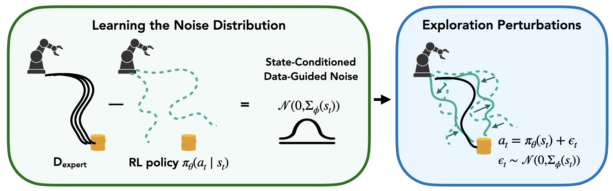

# DGN: Reinforcement Learning via Implicit Imitation Guidance



**Abstract:** We study the problem of efficient reinforcement learning, where prior data such as demonstrations are provided for initialization in lieu of a dense reward signal. A natural approach is to incorporate an imitation learning objective, either as regularization during training or to acquire a reference policy. However, imitation learning objectives can ultimately degrade long-term performance, as it does not directly align with reward maximization. In this work, we propose to use prior data solely for guiding exploration via noise added to the policy, sidestepping the need for explicit behavior cloning constraints. The key insight in our framework, Data-Guided Noise (DGN), is that demonstrations are most useful for identifying which actions should be explored, rather than forcing the policy to take certain actions. Our approach achieves up to 2-3x improvement over prior methods for RL from offline data across seven simulated continuous control tasks.

**Project Page:** https://alessing.github.io/data-guided-noise/

**Paper Link:** https://arxiv.org/abs/2506.07505


# Codebase Overview:

This codebase essentially contains two independent repos: a fork of the [IBRL Codebase](https://github.com/hengyuan-hu/ibrl) to run Robomimic experiments and a fork of the [RLPD Codebase](https://github.com/ikostrikov/rlpd)  to run Adroit experiments.

Further instructions on running experiments with each repo can be found in the READMEs in the corresponding directories.


## Cite Our Paper


```
@misc{dataguidednoise2025,
      title={Reinforcement Learning via Implicit Imitation Guidance}, 
      author={Perry Dong and Alec M. Lessing and Annie S. Chen and Chelsea Finn},
      url={https://arxiv.org/abs/2506.07505}, 
      year={2025},
      primaryClass={cs.LG},
      archivePrefix={arXiv},
      eprint={2506.07505},
}

```